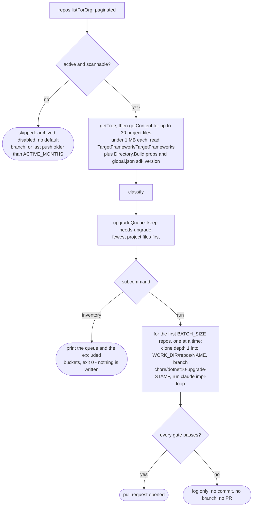
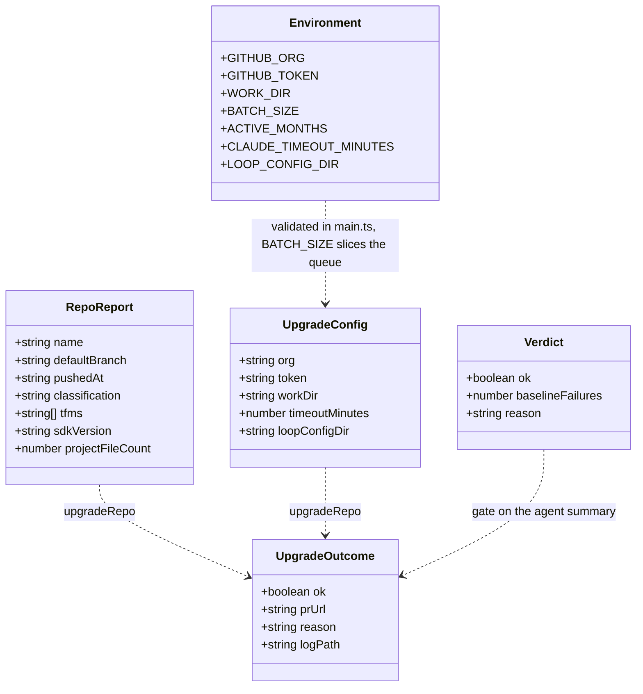
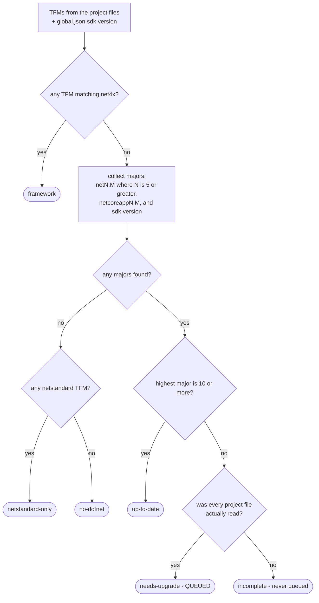
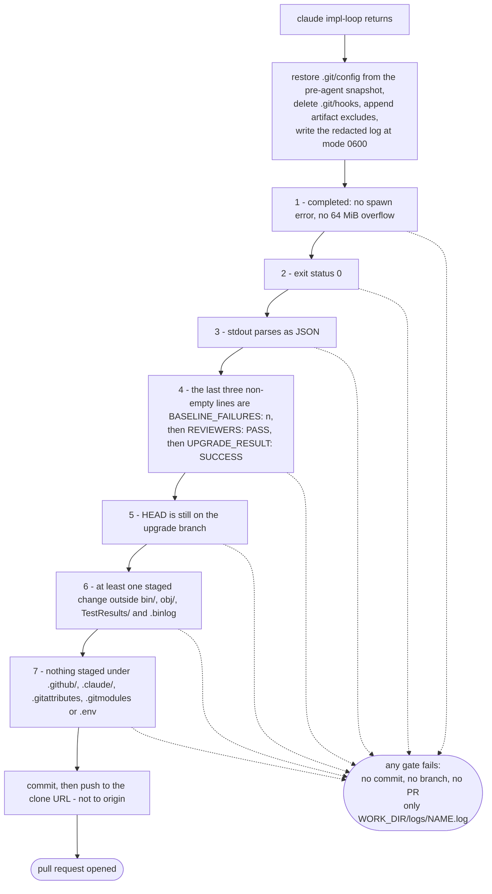
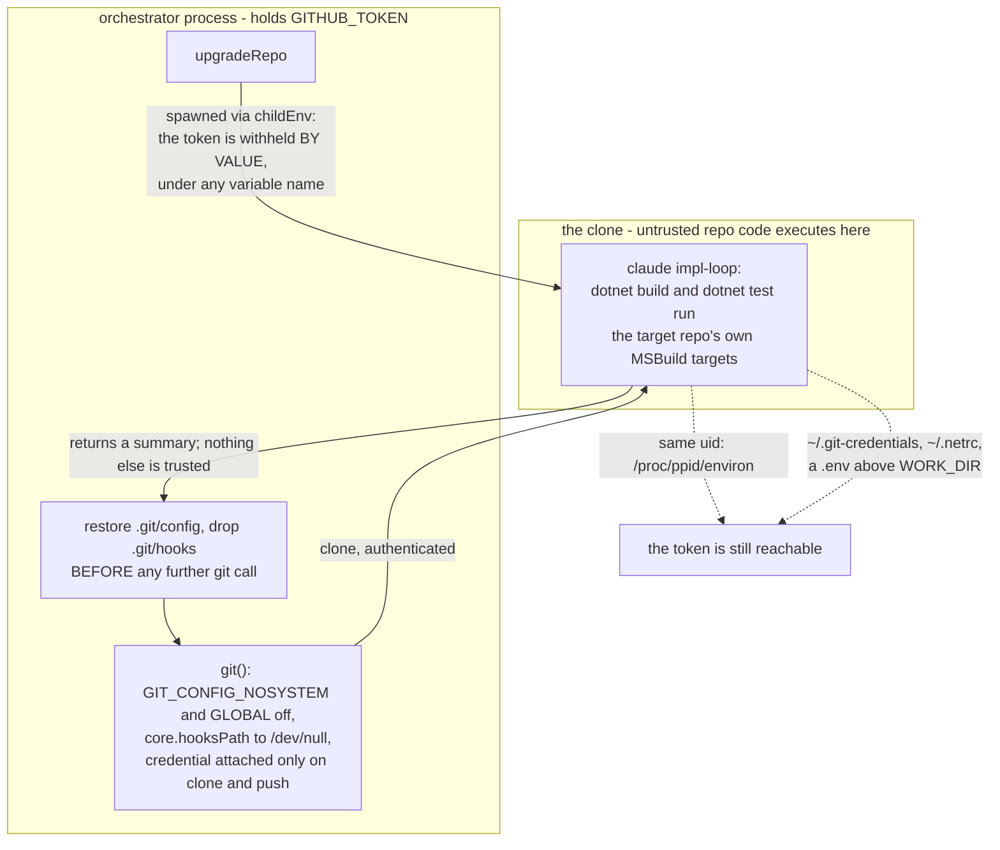

```text
     _         _                  _    _   ___
  __| |  ___  | |_  _ __    ___  | |_ / | / _ \
 / _` | / _ \ | __|| '_ \  / _ \ | __|| || | | |
| (_| || (_) || |_ | | | ||  __/ | |_ | || |_| |
 \__,_| \___/  \__||_| |_| \___|  \__||_| \___/  -upgrader

  org-wide .NET 10 (LTS) upgrades, one reviewed PR at a time
```

# dotnet10-upgrader

CLI that inventories an organization's GitHub repositories for projects targeting modern .NET below version 10, then runs the existing Claude Code `impl-loop` on a small batch to upgrade them to .NET 10 (LTS) and opens pull requests. Humans remain the merge gate.

## How it works



Both subcommands share the whole scan; only `run` continues past the queue.

## Operator prerequisites

- `git` on PATH.
- Claude Code installed and authenticated, with the `impl-loop` slash command (and its agents) available — either in your user-level config or via `LOOP_CONFIG_DIR`.
- .NET 10 SDK installed, plus any SDKs the target repos currently pin.
- A GitHub token (fine-grained PAT or GitHub App token) scoped to **contents: read/write** and **pull-requests: write** for the org.

## Configuration (environment variables)

| Variable | Required | Default | Purpose |
|---|---|---|---|
| `GITHUB_ORG` | yes | — | Organization to scan |
| `GITHUB_TOKEN` | yes | — | Auth for API, clone, and push |
| `WORK_DIR` | no | `./work` | Clones (`repos/`) and per-repo Claude logs (`logs/`) |
| `BATCH_SIZE` | no | `3` | Repos upgraded per `run` |
| `ACTIVE_MONTHS` | no | `12` | Repos pushed within this window count as active |
| `CLAUDE_TIMEOUT_MINUTES` | no | `90` | Per-repo Claude timeout |
| `LOOP_CONFIG_DIR` | no | unset | Copied into each clone as `.claude/` |



`sdkVersion`, `loopConfigDir`, `prUrl`, `reason` and `logPath` are optional; `logPath` is absent when the run failed before the log was written. The six values `classification` can take are in the decision tree below.

## Usage

Both scripts load a gitignored `.env` from the repo root if one is present, so put
`GITHUB_ORG` and `GITHUB_TOKEN` there rather than re-exporting them each shell:

```sh
# .env — gitignored, never committed
GITHUB_ORG=my-org
GITHUB_TOKEN=github_pat_...
```

```sh
npm install

# Read-only dry run: print the upgrade queue and excluded repos.
npm run inventory

# Upgrade the first BATCH_SIZE queue repos sequentially and open PRs.
npm run run
```

A real environment variable always wins over the `.env` entry of the same name, so
CI secrets are never shadowed by a file left on the runner. If you prefer not to
keep the token on disk at all, export it instead — read it from a secret store
rather than inlining it, which would write a live org write-token into your shell
history:

```sh
export GITHUB_TOKEN=$(op read op://vault/dotnet10-upgrader/token)
```

Use the fine-grained PAT or GitHub App token from the prerequisites above — not
`gh auth token`, which hands over your personal token with every scope you hold
across every org you belong to. The upgrade loop runs the target repo's own build,
so the token it sits next to should reach nothing beyond the org being upgraded.
In CI, take `GITHUB_TOKEN` from the runner's secret store, or mint a short-lived
GitHub App installation token per run, rather than a long-lived PAT.

`WORK_DIR` must be a directory of its own: the per-repo clone is deleted and recreated
on every run, so pointing it at the cwd or `$HOME` is refused rather than obeyed.

## What gets queued



Only `needs-upgrade` reaches the write path, and only on complete evidence. A scan is incomplete when the git tree was truncated, or when a repo has more or larger project files than the fetch caps allow. Partial evidence can hide a `net472` project and make a repo look like a clean upgrade candidate — and padding a repo with junk files to push the real TFMs past the cap is a cheap way to aim the agent at it.

## What opens a PR



`run` exits 0 only if every repo in the batch produced a PR. Failures *before* the loop runs — a failed clone, for instance — produce no log at all.

`REVIEWERS: PASS` is a gate in its own right: both `impl-loop` reviewers must return PASS with zero Criticals. `UPGRADE_RESULT` reports only build and tests, so without it a loop that exhausts the 4-round cap with unresolved Critical findings would still open a PR on a green build.

The test bar is **no regression**, not a green suite. The agent runs `dotnet build` and `dotnet test` before its first edit to establish a baseline, and a PR opens only if the build passes and every test still failing was already failing then. Tests that were already red may stay red; a test that was passing and now fails blocks the PR. The count is reported as `BASELINE_FAILURES: <n>`, and any non-zero count is stated on the face of the PR with a checklist item to confirm it against the base branch.

The baseline is the agent's own claim — the orchestrator does not run the suite itself. What makes it checkable: the baseline must be captured *before* the first edit (never reconstructed later by stashing), every carried-forward failure must be named in the summary, and `WORK_DIR/logs/<repo>.log` holds the verbatim transcript, so the ordering and the named tests can be audited against the base branch's own CI.

## Isolation



Solid edges are what the design controls; dashed edges are what it does not. Restoring the config we cloned with and dropping the hooks directory closes a whole class at once — a repo-planted hook, `filter.*.clean`, or `url.*.insteadOf` can neither run under our credential nor redirect the push.

What that does **not** cover: the agent runs as the same uid as this process, so it can
still read the parent's environment (`/proc/<ppid>/environ`), `~/.git-credentials`,
`~/.netrc`, and any `.env` above `WORK_DIR`. Keep `WORK_DIR` outside the directory
holding your `.env`, and run the whole thing in a container or under a dedicated uid if
the org's repos are not all trusted.

## Self-checks

`npx tsx src/inventory.ts` (classifier, parse bounds, queue gate) and
`npx tsx src/upgrade.ts` (success gate, token withholding and redaction, staged-path
gates, PR-body quoting, and a live check that git runs no repo-planted hook).
